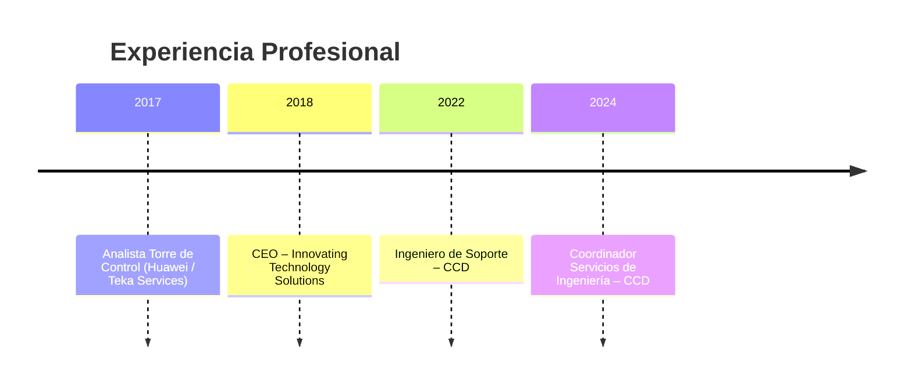

## Hi there 👋

  

🚀 **Ingeniero de Sistemas y Ciberseguridad** con más de 7 años de experiencia en:  
🔹 **MDR / XDR** | Arquitecturas de defensa | Respuesta a incidentes | Análisis de malware  
🔹 Implementación de soluciones con **Trellix, Acronis, Cisco, Radware, Imperva y CyberArk**  
🔹 Diseño de estrategias bajo **MITRE ATT&CK, NIST e ISO 27001**

💡 Me interesa poder **ayudar a las organizaciones a protegerse proactivamente frente a amenazas avanzadas.**

---

  

---

## 🛠️ Tech Stack 

### 🛡️ Ciberseguridad & Redes  

  

### 💻 Lenguajes & Scripting  

  

### 🧪 Threat Hunting & Análisis de Malware  

  
  
  
  
  

  🔹 Análisis dinámico y estático de malware | Reverse Engineering básico

### 🗄️ Bases de Datos  

  

### 🤖 Ciencia de Datos & ML  

  

### 🕵️ Pentesting & Forense  

  
  
  
  
  

  🔹 Técnicas de intrusión controlada, explotación y reporting

### 🎨 Diseño & Herramientas  

  

---

## 📊 GitHub Stats  

  

  

  

---

## 📂 Proyectos Destacados  
🔹 [Write-ups TryHackMe](#) – Laboratorios prácticos de forense y malware  
🔹 [Automatización en Python](#) – Scripts para análisis de seguridad  
🔹 [Análisis de artefactos maliciosos](#) – Uso de YARA, sandboxing y Brim

---

## 🕒 Timeline Profesional  

---

## 🧑‍💻 Perfil TryHackMe  

  

---

## 📜 Certificaciones  

  
  
  
  
  
  
  
  
  
  
  
  
  
  

---

## 🌐 Conecta conmigo  

  
  

📧 **japi104@hotmail.com**  

---

✨ "La ciberseguridad no es un producto, es un proceso continuo." ✨

  

